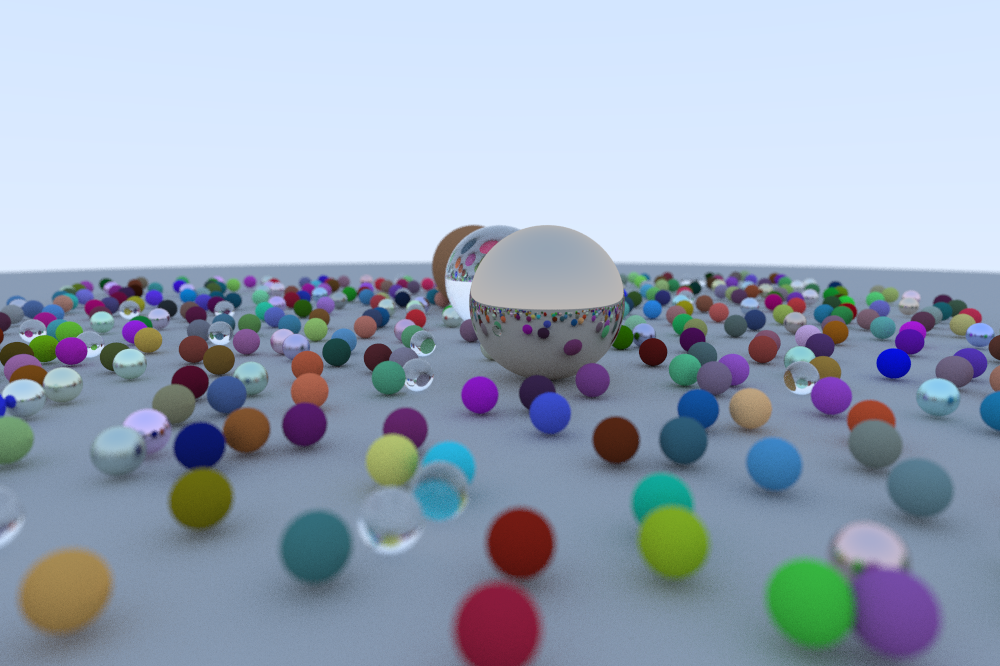

# Renderer
A raytracing renderer out of personal insterest and c++ practice. Keep updating.
# How to use
1. First predefine a secne we want in [generate_scene.h](https://github.com/owaranainatsu/Renderer/blob/main/generate_scene.h). Then call it [here](https://github.com/owaranainatsu/Renderer/blob/64c9f9debf3f5aeaee9f2d73b7c8f4e2a3a661c4/main.cpp#L40) in main.cpp.
2. Compile main.cpp to get an executable file main.exe.
3. Use command ```main.exe > image.ppm``` to generate a ppm format image, then use a [ppm viewer](https://www.cs.rhodes.edu/welshc/COMP141_F16/ppmReader.html) to show the result.
# Results Preview

# To do list
Countless work to do but first:
1. BRDF model
2. Add texture, volume and point cloud
3. Parallel computation

# References
1. [_Ray Tracing in One Weekend_](https://raytracing.github.io/books/RayTracingInOneWeekend.html)
2. [_Ray Tracing: The Next Week_](https://raytracing.github.io/books/RayTracingTheNextWeek.html)
3. [_Ray Tracing: The Rest of Your Life_](https://raytracing.github.io/books/RayTracingTheRestOfYourLife.html)
4. Fundamentals of Computer Graphics 5th Edition
